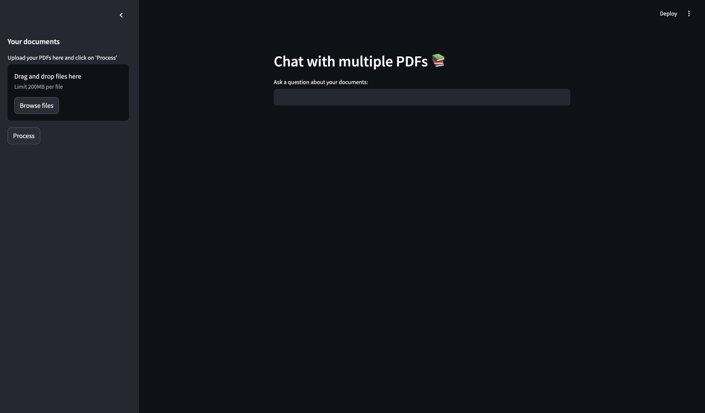
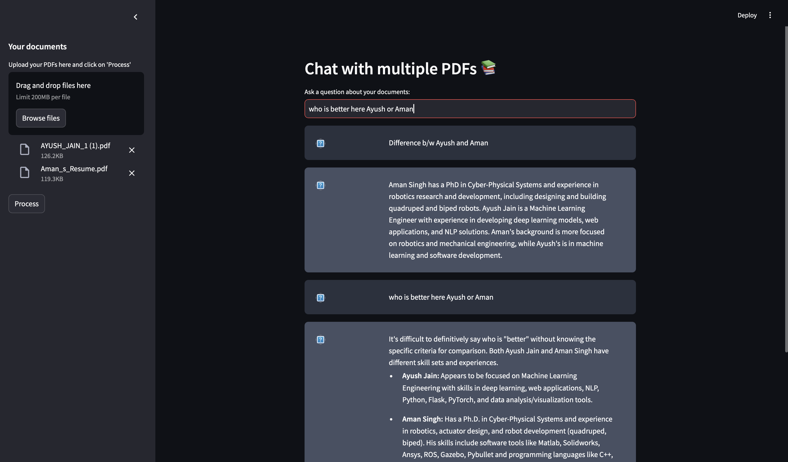

# Chat with Multiple PDFs - Streamlit App


<div style="display: flex; justify-content: center; gap: 20px;">
    
    
</div>


This is a simple Streamlit application that allows you to interact with multiple PDF documents and ask questions about the contents. The app processes the uploaded PDFs, splits the text into manageable chunks, creates embeddings for the chunks, and sets up a conversational AI model to answer your questions based on the processed documents.


## Features:
- Upload multiple PDF files
- Process and extract text from the PDFs
- Split text into smaller chunks for better management
- Use Generative AI models to create embeddings and store them in a vector database
- Engage in conversation with the AI based on the uploaded documents

## Requirements:
- Python 3.7+
- `streamlit` - Web framework for interactive applications
- `python-dotenv` - For managing environment variables
- `PyPDF2` - For reading PDFs
- `langchain` - For NLP tasks and conversational AI
- `FAISS` - For fast nearest neighbor search
- `langchain_google_genai` - For embedding generation and generative AI

You can install all the required libraries using `pip`:

```bash
pip install streamlit python-dotenv PyPDF2 langchain langchain_google_genai faiss-cpu